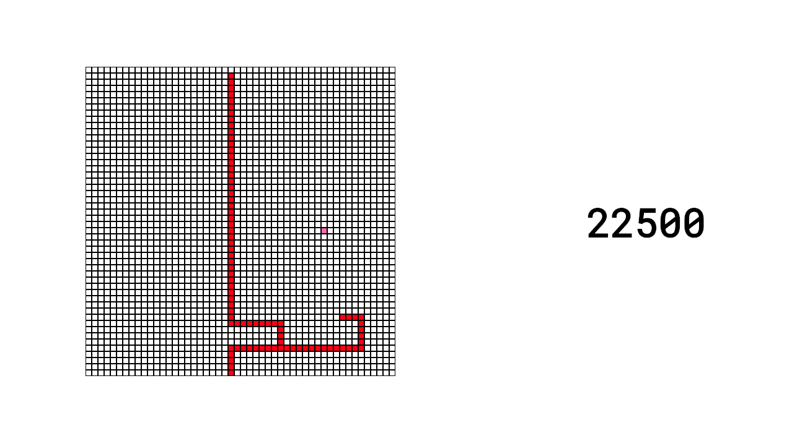
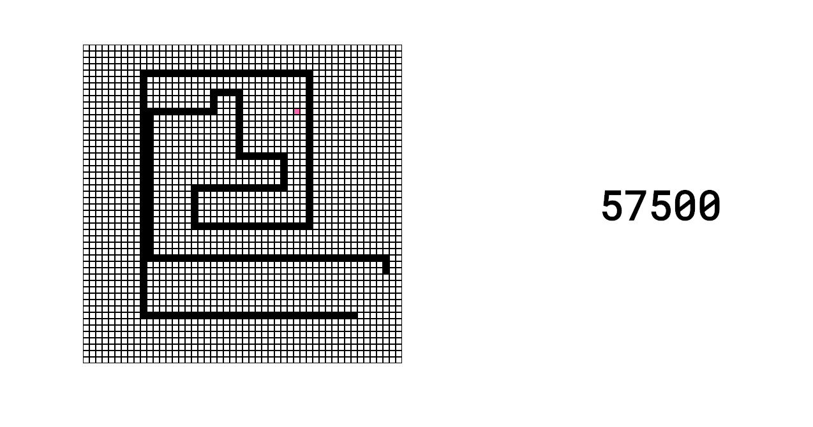

#  Project 1.5

# **Snake**  (a weekend extra)


## Overview

I have called this **Project 1.5** as it wasn't undertaken as part of the GA SEI bootcamp but rather as an optional extra, after my struggles during ["Tetris Week"](https://github.com/Lily-La-Day/sei-project-one-tetris/blob/master/README.md) I decided to give myself  a "treat" so I built Snake over the weekend!

Snake was one of the other options given as part of the brief for project one but I didn't refer to the spec.

I kept it very simple and also made playing the game itself as challenging as possible. In my youth I was a snake master and I really just wanted to test whether I had retained this mastery (turns out I have).

The game can be played here: https://lily-la-day.github.io/snake/


## How to Play

* Up, Down, Left, Right arrows correspond to direction.
* Snake can go through walls but will die if he goes into himself.
* Your job is to eat the pink "fruit" and to avoid dying for as long as possible.




## The process

**The Grid**

The snake board was a dynamically generated JavaScript grid. I played around with larger grid areas but decided to keep them small at just 10px on a 500 x 500 grid.


**Movement and Growth**

The snake himself is an array that gets longer as the game progresses and more food is eaten. He moves as a result of adding/subtracting from the index numbers of his grid position accordingly.

I encountered one big coding problem in the course of making this game and that was my total inability to re-factor this code into something more concise. I hope to come back to this as I realise that this function is far from ideal! It does the job of increasing the snake's length, the proportional incrementation increasing depending on the user's score.  


```js
const growSnake = (nextPosOne) => {
  if(scoreTracker < 1000){
    snakePos.push(nextPosOne)
    snakePos.push(nextPosOne)
  } else if (scoreTracker < 3000) {
    snakePos.push(nextPosOne)
    snakePos.push(nextPosOne)
    snakePos.push(nextPosOne)
    snakePos.push(nextPosOne)
  } else {
    snakePos.push(nextPosOne)
    snakePos.push(nextPosOne)
    snakePos.push(nextPosOne)
    snakePos.push(nextPosOne)
    snakePos.push(nextPosOne)
    snakePos.push(nextPosOne)
    snakePos.push(nextPosOne)
    snakePos.push(nextPosOne)
    snakePos.push(nextPosOne)
    snakePos.push(nextPosOne)
    snakePos.push(nextPosOne)
    snakePos.push(nextPosOne)

  }
}
```

**Winning and Losing**

There is no way to win Snake unfortunately, it is a matter of when you lose and with what score!

Losing happens when the snake's head meets the snake's body. I decided to determine this using this function:

```js
//stored num is the snakes length
const loseFunc = (storedNum) => {
  //its current position
  const nowPos = [...document.querySelectorAll('.snake')]
  //the index positions of the snake's current poistion
  const nowPosNums = nowPos.map(pos=>parseInt(pos.dataset.index))
  //the snake without its head
  const withoutHead = nowPosNums.slice(1)
  //if the snake's length  without its head is less than its length before (and there is food present)
  if (withoutHead.length < storedNum && squares.some(square => square.classList.contains('food'))){
    //the snake dies
    nowPos.forEach(pos => pos.classList.add('dead-snake'))
    squares.forEach(square => square.classList.remove('snake'))
    shouldMove = false
  }
}
```

The lose condition was therefore the snake becoming shorter than it had been previously (ie its head overlapped its body) while there was food on the board. If I was to start this project from scratch I would choose a different lose condition as this left too much room for glitches considering the speed at which the snake moves and its considerable length.

It also meant that I had to have a noticeable delay between food being eaten and new food being created to allow for the snake to grow.


**Improvements and Future Additions**

I have added a function that is intended to increase the speed as the player's score increases, it does not work however, as a setInterval function's value can not be set in this manner. I would like to correct this.


```js

const speedFunc = () => {

  switch(scoreTracker) {
    case scoreTracker < 3000:
      speed = 50
      break
    case scoreTracker < 7000:
      speed = 30
      break
    case scoreTracker < 10000:
      speed = 10

  }
  return speed
}
```

I would also like to store player's scores using local storage (basically so I can show off my skills, proving that those childhood hours (well days/weeks/months) lost to the Nokia3310 were not spent in vain.




(Just as proof)
